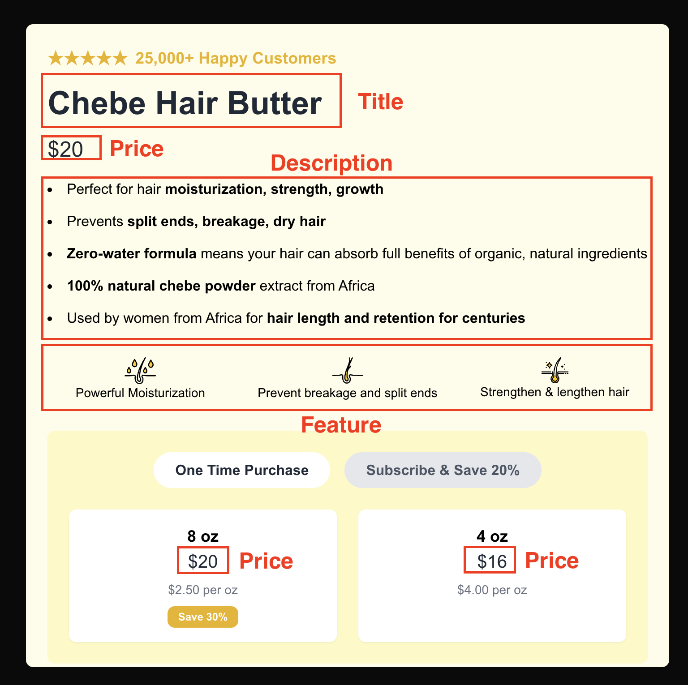

# ABConvert interview project

This is an interview project to evaluate candidate's technical proficiency. You will be required to build an A/B testing feature based on the boilerplate repository.

## Description

Imagine you are running an ecommerce store, and you want to A/B test your product page for Black Friday to have better profit this year.

There will be several things you can test:

1. Price
2. Title
3. Description
4. Feature

Please build an easy-to-use feature that you can:

- Input your test information and start an A/B test
- Monitor A/B testing results

There must be randomization logic and event tracking for a standard A/B testing practice.

There will be two tracks for this interview:

1. Backend track: for candidates who are applying for our Sr. Backend Engineer position
2. Full stack track: for candidates who are applying for our Full Stack Engineer position

In each track, the requirements will be different, and you can find them in the following links:

1. [Backend Track Requirements](requirement/backend/README.md)
2. [Full Stack Track Requirements](requirement/full-stack/README.md)

## Estimated time to finish

Approximately 3 hours - 2 days

## Deliverables:

1. Source code in a GitHub repository.
2. A README file explaining:

   - How to set up and run the project.
   - Design decisions made during the development.

3. Deployed versions of the frontend and backend (URLs).
4. A brief document explaining how you ensured scalability, performance, and maintainability.
5. Demo video

Please send your submission files to talent@abconvert.io.

## Evaluation criteria

1. Coding practice: including code quality, commit history, and development style
2. Documentation: whether you are good at communication through writing
3. System design: how you tackle the problem

## How to start the project

- `yarn install` or `npm install` to install the dependencies
- `yarn dev` or `npm run dev` to start the local development server
