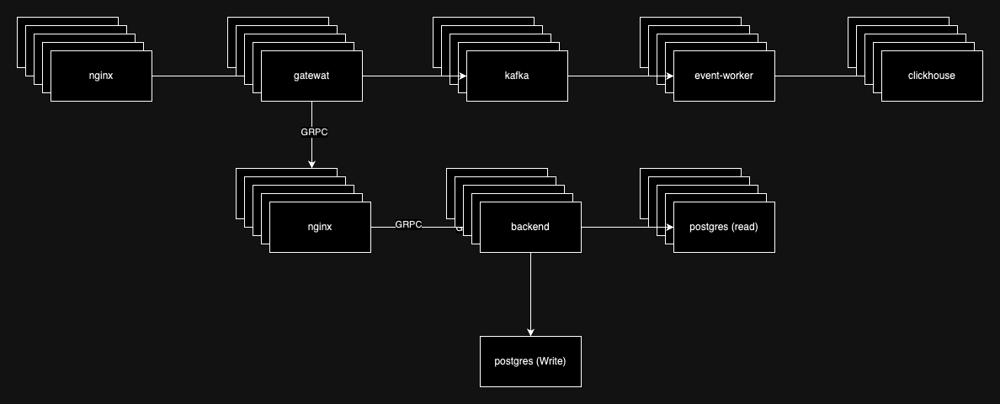
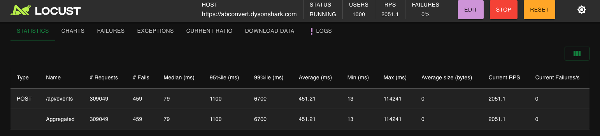

# ABConvert interview project

## Development

Please first install [ASDF](https://asdf-vm.com/guide/getting-started.html) to control local Node installations. Our Node versions are fixed and enforced inside `.tool-versions` and `package.json`, which are aligned with the node versions inside each `Dockerfile`.

```bash
# Install the specified version
asdf install nodejs 20.9.0

# List all installed versions
asdf list

# Check currently resolved version
asdf current
node -v
```

### IDE Setup

If you are using VSCode, first install the extensions:

- ESLint
- Prettier - Code formatter
- Tailwind CSS IntelliSense
- Nx Console


## Microservices

Start / stop the microservices:

```bash
# Start the microservices:
./scripts/start-ms.sh

# Start and build the microservices:
./scripts/start-ms.sh --build

# Stop the microservices:
./scripts/stop-ms.sh
```

## Web server

Install monorepo dependencies:

```bash
npm install
```

Run migration to setup the database:

```bash
./scripts/refresh-schema.sh
```

Serve the frontend and / or the backend:

```bash

# Frontend
npm run frontend:dev

# Backend
npm run backend:dev

# Event Worker
npm run event-worker:dev

# Gateway
npm run gateway:dev
```

Then you can see the website at http://localhost:3000/

## Backend

### Migration

```shell
# Create a new migration file
./scripts/migrate.sh create <name>

# Apply database migrations to the latest version
./scripts/migrate.sh up

# Rollback the database to the previous version
./scripts/migrate.sh down
```

### Schema Generator

#### _!!! Caution: Do not use this script on a production server !!!_

```shell
# Drop and regenerate the database schema and seed data
./scripts/refresh-schema.sh

# Optional: Regenerate the schema without seeding data
./scripts/refresh-schema.sh --no-seed
```

Please note that the provided script should only be used in a development environment and not on a production server to avoid any unintended consequences.


## Architecture

### Components

* backend
  * The backend receives requests from the gateway and handles A/B testing version control.
* gateway
  * The gateway dispatches user events to the Kafka server and proxies requests to the backend.
* event-worker
  * The event worker acts as a Kafka broker, processing user events and store its to clickhouse.
* kafka
  * A distribute message queue to receive the use event.
* clickhouse
  * a distribute database to store the user event.
* postgres 
  * Store product information. Since the product information does not require high throughput, it is chosen to ensure the ACID principles.


**The communication protocol between the backend and gateway is GRPC.**
**All components can extend horizontal.**

### Scalability & Performance

On `4 Core CPU and 4GB memory` machine with 60/20MBps network.

500 clients


1000 clients


### Data storage

The events will be stored in clickhouse for high throughput, while item information will be handled in postgres for atomicity, given that item information doesn't require high throughput.

*(it can be rewritten in command query responsibility segregation if needed  )*

also the item information can be stored to the cache like redis (currently it is not implemented)


### Fault Tolerance

The system can be deployed on kubernetes to make sure the fault tolerance.

